# Stock Tracking / ERP Resource Management MVP

<p>
  
  
  
  
  
  
  
  
</p>

## 🏢 Project Overview

Stock Tracking / ERP Resource Management MVP is a full-stack ERP-style inventory and warehouse management system built to demonstrate real-world business workflows.

The application covers core ERP modules such as **product management, warehouse management, stock balances, stock movements, user management, role-based access control, and dashboard reporting**. It goes beyond basic CRUD operations by implementing business rules such as **stock movement validation, reversal logic, permission-based access, session handling, decimal-safe calculations, and server-side filtering, sorting, and pagination**.

The project is developed with **Node.js, Express, PostgreSQL, Prisma, React, TypeScript, and Docker**, and is **deployed on a live VPS-based demo environment**.

## 🌐 Live Demo

A live demo environment is available for reviewing the application flow, UI structure, authentication, authorization, warehouse operations, product management, stock balances, stock movements, and dashboard features.

- **Frontend:** [https://stock.onyilprojects.com/app](https://stock.onyilprojects.com/app)
- **Backend API:** [https://api.stock.onyilprojects.com](https://api.stock.onyilprojects.com)

### Demo Access

A limited demo account can be used to explore the application:

```txt
Email: demo.salesman@example.com
Password: Demo12345!
```

## ✨ Key Features

This project includes the core building blocks of an ERP-style inventory and warehouse management system. The feature set is designed to demonstrate both **business-oriented workflows and production-oriented engineering practices such as validation, authorization, server-side querying, transactional stock operations, and deployment-ready architecture**.

The main feature areas are organized into the following modules:

### 👤 User & Access Management

The application provides a user management module for handling internal ERP users and operational staff. Users can be created, updated, activated, deactivated, and assigned to different roles according to their responsibilities.

The module is integrated with authentication, session management, login logs, role assignments, time-limited role assignments, and permission-based access control. It supports different user profiles such as administrators, managers, warehouse staff, and sales users while keeping account status, access level, and security-related actions manageable from the system.

Time-limited role assignments allow temporary access to be granted for specific operational needs such as delegation, replacement, testing, or short-term authorization.

### 🛡️ RBAC Permission System

The project includes a role-based access control system designed for managing authorization in an ERP-style application. Access rules are managed through **roles, permissions, role-permission mappings, and user-specific permission overrides\***.

Permissions are structured around application resources and actions, allowing the system to control which users can access, create, update, delete, or manage specific modules. In addition to role-based permissions, user-level allow and deny rules can be applied for more granular access control.

The authorization logic follows a clear priority model where explicit deny rules take precedence, while super admin users can bypass standard permission checks. This structure allows flexible access management for different operational roles such as admin, manager, warehouse staff, and sales users.

### 🏬 Warehouse Management

The application includes a warehouse management module for creating and managing physical or operational stock locations. Warehouses can be configured with status, activity state, address information, capacity-related fields, default warehouse behavior, and operational metadata.

**Warehouse records are connected with stock balances and stock movements, allowing the system to track product quantities, warehouse-level inventory value, critical stock situations, and recent stock activity**.

### 📦 Product Management

The product management module allows products to be created, updated, categorized, priced, activated, deactivated, and connected with base units and stock tracking rules.

Products are integrated with product categories, measurement units, stock balances, and stock movements. **The system supports searchable product selection, barcode/SKU-based identification**, buy and sell prices, and inventory-related business rules for stock-controlled products.

### 📊 Stock Balance Management

Stock balances represent the current inventory state of each product in each warehouse. The module tracks total quantity, reserved quantity, available quantity, critical stock quantity, reorder quantity, and last movement information.

The balance structure allows the system to monitor warehouse-level product availability, detect critical stock situations, prevent invalid reserved quantities, and provide accurate data for dashboard summaries and inventory tables.

### 🔁 Stock Movement Management

The stock movement module manages inventory transactions such as **opening balances, purchases, sales, transfers, adjustments, returns, production-related movements, and reversals**.

Each stock movement affects the related stock balance according to its direction. Incoming movements increase quantity, while outgoing movements decrease quantity with stock availability checks. The system also supports movement reversal logic, balance snapshots, price update modes, and decimal-safe total calculations to keep inventory operations consistent and traceable.

### 📈 Dashboard & Reporting

The dashboard provides a compact overview of the inventory system by combining product, warehouse, stock balance, and stock movement data into summary cards and operational tables.

It includes metrics such as total products, critical stock count, recent stock movements, total quantity, total inventory cost, and total inventory sales value. Warehouse snapshot cards and dashboard tables help users quickly review the current inventory state and recent operational activity.

### 🧾 Audit-Oriented Design

The project follows an audit-oriented design approach by keeping operational actions traceable and structured. Important flows such as **authentication, role assignments, login activity, stock movements, and movement reversals are modeled with accountability and historical visibility in mind**.

**Stock movements are not simply overwritten; instead, reversal operations create separate records and preserve the original movement state. This approach improves traceability, supports operational review, and reflects a more realistic ERP-style data management pattern**.

## 🧰 Tech Stack

The project is built with a modern full-stack TypeScript ecosystem, combining a Node.js backend, a React frontend, a PostgreSQL database, a shared package, internationalization support, and a Docker-based deployment environment.

The stack was selected to support type safety, maintainable business logic, server-side data operations, responsive UI development, reusable validation rules, multilingual application structure, and production-oriented deployment practices.

### ⚙️ Backend

- **Node.js**
- **Express.js**
- **TypeScript**
- **Prisma ORM**
- **Zod**
- **JWT Authentication**
- **Nodemailer**
- **Centralized error handling**
- **i18n-friendly error response structure**
- **Generic API controller structure**

### 🎨 Frontend

- **React**
- **TypeScript**
- **Vite**
- **React Router**
- **React Query**
- **React Hook Form**
- **Styled Components**
- **Permission-aware UI components**
- **Responsive layout structure**
- **Internationalization-ready UI structure**

### 🔗 Shared Package

- Shared TypeScript types
- Shared validation schemas
- Shared constants and enums
- Shared business definitions
- Shared i18n keys and translation-related definitions
- Backend/frontend consistency layer

### 🗄️ Database

- **PostgreSQL**
- Prisma migrations
- Relational ERP-style data model
- Decimal-safe inventory and price fields
- Stock balance and stock movement records
- Sessions and login logs

### 🚢 Infrastructure & Deployment

- **Docker**
- **Docker Compose**
- **Caddy**
- **Nginx**
- VPS-based deployment
- Separate frontend and backend services
- PostgreSQL service
- Domain-based reverse proxy setup

### 🧪 Development & Testing Tools

- Seed scripts
- RBAC seed/export scripts
- Admin bootstrap script
- Demo database reset workflow
- **MailHog**
- **pgAdmin**

## 🏗️ Architecture Overview

The project is organized as a full-stack monorepo-style application with separate backend, frontend, and shared packages. This structure keeps API logic, user interface code, and shared business definitions clearly separated while allowing common types and validation rules to be reused across the application.

```text
    /backend
    /frontend
    /shared
```

### Structure

- **backend:**
  Contains the Express API, Prisma database layer, authentication, RBAC, business logic, validation, stock operations, seed scripts, and deployment-related backend configuration.

- **frontend:**
  Contains the React application, route structure, UI components, feature modules, forms, tables, dashboard screens, permission-aware views, and responsive layout logic.

- **shared:**
  Contains shared TypeScript types, validation schemas, constants, enums, i18n-related definitions, and reusable business rules used by both the backend and frontend.

This separation improves maintainability, reduces duplication, and keeps the backend and frontend aligned through a shared TypeScript-based contract.

## ⚙️ Backend Overview

The backend is designed as a modular REST API built with **Node.js**, **Express**, **TypeScript**, **Prisma**, and **PostgreSQL**. It handles authentication, authorization, business rules, validation, stock operations, dashboard data, seed workflows, and system-level access control.

The backend structure follows a feature-oriented approach where each business area is separated into modules. This makes the API easier to maintain, extend, test, and evolve as the project grows from an MVP into a larger ERP-style system.

### Main Backend Modules

- **Authentication**
  - Login
  - Access and refresh token handling
  - Session-aware authentication flow
  - Login logs

- **IAM / RBAC**
  - Role-based access control
  - Permissions
  - Roles
  - Role-permission mappings
  - User-specific permission overrides
  - Super admin bypass logic

- **Users**
  - User management
  - Role assignments
  - Time-limited role assignments
  - User sessions
  - Account activation / deactivation

- **Addresses**
  - Countries
  - Cities
  - Districts
  - Address records
  - Warehouse address integration

- **Stocks**
  - Warehouses
  - Units
  - Product categories
  - Products
  - Stock balances
  - Stock movements
  - Movement reversal logic
  - Price update modes

- **Dashboard**
  - Inventory summary data
  - Warehouse snapshot data
  - Recent movement metrics
  - Stock value calculations
  - Critical stock indicators

### Backend Highlights

- Generic API controller structure for reusable CRUD operations
- Server-side filtering, sorting, field selection, includes, and pagination
- Zod-based request validation
- Centralized error handling with i18n-friendly error responses
- Prisma-based relational data modeling
- Transactional stock movement operations
- Decimal-safe inventory, cost, and price calculations
- Seed scripts for demo data and RBAC initialization

## 🎨 Frontend Overview

The frontend is built with **React**, **TypeScript**, and **Vite**. It provides a responsive ERP-style user interface for authentication, dashboard monitoring, user management, warehouse operations, product management, stock balances, stock movements, and system settings.

The frontend follows a feature-oriented structure and uses reusable UI components, shared form patterns, permission-aware rendering, server-state management, and URL-based filtering to create a scalable application experience.

### Main Frontend Modules

- **Authentication**
  - Login page
  - Protected routes
  - Auth-aware application layout
  - Session-based user state

- **App Layout**
  - Header
  - Sidebar navigation
  - Mobile navigation behavior
  - Responsive main layout
  - Scrollable content area

- **User Management**
  - User list
  - User detail views
  - Role assignment UI
  - Permission management UI
  - Session management UI
  - Login log views

- **Settings / Address Management**
  - Country management
  - City management
  - District management
  - Address-related configuration screens

- **Inventory / Stock**
  - Warehouse list and detail pages
  - Product list and detail pages
  - Unit management
  - Product category management
  - Stock balance tables
  - Stock movement tables
  - Movement reversal actions

- **Dashboard**
  - Summary cards
  - Warehouse snapshot cards
  - Stock balance table
  - Stock movement table
  - Server-driven dashboard data

- **Shared UI / Form System**
  - Reusable form fields
  - Async select components
  - Search and filter components
  - Table components
  - Query state components
  - Empty, loading, and error states

### Frontend Highlights

- React Query-based server-state management
- React Hook Form-based form handling
- Permission-aware UI rendering
- Reusable SearchBox and AsyncSelect patterns
- URL query parameter based filtering and pagination
- Responsive layout with mobile/tablet support
- Styled Components-based design system
- i18n-ready UI structure
- Shared validation/type alignment through the shared package

## 🗄️ Database & Data Model

The application uses **PostgreSQL** as the main relational database and **Prisma ORM** for schema modeling, migrations, and type-safe database access.

The data model is designed around ERP-style operational entities such as users, roles, permissions, addresses, warehouses, products, units, stock balances, stock movements, sessions, and login logs.

### Main Data Areas

- **Identity & Access**
  - Users
  - Sessions
  - Login logs
  - Roles
  - Permissions
  - Role-permission mappings
  - User-specific permission overrides

- **Address Management**
  - Countries
  - Cities
  - Districts
  - Address records

- **Inventory Management**
  - Warehouses
  - Units
  - Product categories
  - Products
  - Stock balances
  - Stock movements

The schema is structured to support relational consistency, decimal-safe inventory values, stock traceability, permission-based access, and realistic ERP-style business workflows.

## 🔐 Authentication & Authorization

The project includes an authentication and authorization structure designed for internal ERP users and role-based operational access.

Authentication is handled with **JWT-based access and refresh tokens**, session-aware login flow, login logs, account status checks, and security-related user state management.

Authorization is managed through a custom **RBAC permission system**. Users receive access through roles, role-permission mappings, and optional user-specific allow or deny overrides.

### Authorization Highlights

- JWT access and refresh token flow
- Session-based authentication tracking
- Login activity logging
- Role-based access control
- Resource-action based permissions
- User-level permission overrides
- Explicit deny priority
- Super admin bypass logic
- Time-limited role assignments
- Permission-aware frontend rendering

This structure allows different operational users such as administrators, managers, warehouse staff, and sales users to access only the modules and actions they are authorized to use.

## 📦 Inventory Management Logic

The inventory logic is designed around two core concepts: **stock balances** and **stock movements**.

A stock balance represents the current inventory state of a specific product in a specific warehouse. A stock movement represents an operational transaction that changes inventory, such as opening balance, purchase, sale, transfer, adjustment, return, production-related movement, or reversal.

### Stock Balance Logic

- Tracks product quantity per warehouse
- Tracks reserved and available quantities
- Supports critical stock and reorder quantity fields
- Stores last movement information
- Prevents invalid reserved quantity states
- Feeds dashboard and warehouse-level inventory summaries

### Stock Movement Logic

- Supports incoming and outgoing inventory operations
- Updates the related stock balance according to movement direction
- Prevents outgoing movements when stock is insufficient
- Stores previous and new balance snapshots
- Supports movement reversal through separate reversal records
- Preserves the original movement instead of overwriting history
- Supports buy/sell price update modes
- Performs decimal-safe quantity, cost, price, and total calculations

This approach keeps inventory operations consistent, traceable, and closer to real ERP behavior than a basic CRUD-based stock table.

## 📈 Dashboard & Reporting

The dashboard provides a compact operational overview of the current inventory state. It combines product, warehouse, stock balance, and stock movement data into summary cards, warehouse snapshots, and dashboard tables.

### Dashboard Metrics

- Total products
- Critical stock count
- Recent stock movement count
- Total stock quantity
- Total inventory cost value
- Total inventory sales value

### Dashboard Components

- Summary cards for high-level inventory metrics
- Warehouse snapshot cards for warehouse-level status
- Stock balance table for current inventory visibility
- Stock movement table for recent operational activity
- Server-driven filtering, pagination, and data loading

The dashboard is intentionally kept simple for the MVP stage while still providing useful operational insight into stock status and recent inventory activity.

## 🌱 Seed Data & Demo Environment

The project includes seed scripts for creating a realistic demo environment. Seed data is used to populate core ERP entities and make the live demo easier to review without manual setup.

### Seeded Data Areas

- Countries, cities, districts, and addresses
- Users
- Roles and permissions
- Units
- Product categories
- Warehouses
- Products
- Stock balances
- Stock movements

The demo environment is designed to be periodically reset so that sample data remains clean, consistent, and reviewable.

### Demo Workflow

- RBAC permissions are initialized from seed data
- A super admin user can be bootstrapped
- Demo users and operational records are generated
- Inventory data is recreated through product, warehouse, balance, and movement seeds
- Reset scripts help keep the demo environment stable over time

This setup makes the application easier to evaluate as a live MVP while preserving a predictable demo dataset.

## 🐳 Docker & Deployment

The application is containerized with **Docker** and orchestrated with **Docker Compose**. The live demo is deployed on a VPS-based environment with separate services for the frontend, backend API, PostgreSQL database, and reverse proxy.

### Deployment Structure

- **Frontend**
  - Built as a static React application
  - Served through a web server container

- **Backend API**
  - Runs as a Node.js / Express API service
  - Connects to PostgreSQL through the internal Docker network

- **Database**
  - PostgreSQL runs as a dedicated service
  - Data is persisted through Docker volumes

- **Reverse Proxy**
  - Caddy routes public domains to the correct services
  - Frontend and API are exposed through separate domains

### Supporting Services

- MailHog for local email testing
- pgAdmin for local database inspection
- Docker volumes for persistent database storage
- Docker networks for service-to-service communication

This deployment setup keeps the application portable, reproducible, and close to a production-oriented full-stack deployment workflow.

## 🔐 Environment Variables

The project uses environment variables to configure the database, backend API, authentication, frontend runtime values, email service, development tools, and demo bootstrapping flow.

Sensitive values such as database passwords, JWT secrets, email credentials, and bootstrap admin credentials should never be committed to the repository. Instead, create a local `.env` file based on `.env.example`.

```env
# PostgreSQL
POSTGRES_DB=
POSTGRES_USER=
POSTGRES_PASSWORD=
POSTGRES_PORT=

# Backend
NODE_ENV=
PORT=
BACKEND_PORT=

DATABASE_URL=

# MailHog / Email
EMAIL_USERNAME=
EMAIL_PASSWORD=
EMAIL_HOST=
EMAIL_PORT=
EMAIL_SECURE=
EMAIL_FROM=

# Authentication
WRONG_ATTEMPT_RANGE=
ACCESS_TOKEN_SECRET=
REFRESH_TOKEN_SECRET=
ACCESS_TTL_MIN=
REFRESH_TTL_DAYS=
MAX_SESSIONS=

# API Features
MAX_TAKE_LIMIT=
ADMIN_ROLE_LEVEL=
MANAGER_ROLE_LEVEL=

# Frontend
FRONTEND_PORT=
VITE_API_URL=
VITE_API_VER=
VITE_PAGE_SIZE=
VITE_BOTTOM_H=
VITE_TOP_H=

# PgAdmin
PGADMIN_DEFAULT_EMAIL=
PGADMIN_DEFAULT_PASSWORD=
PGADMIN_PORT=

# MailHog Ports
MAILHOG_UI_PORT=
MAILHOG_SMTP_PORT=

# Timezone
TZ=

# Bootstrap Super Admin
BOOTSTRAP_SUPER_ADMIN_EMAIL=
BOOTSTRAP_SUPER_ADMIN_PASSWORD=
BOOTSTRAP_SUPER_ADMIN_NAME=
BOOTSTRAP_SUPER_ADMIN_ROLE_KEY=

# Client / CORS
CLIENT_URL=
CORS_ORIGIN=
```

### Notes

- `DATABASE_URL` is used by Prisma to connect the backend to PostgreSQL.
- `ACCESS_TOKEN_SECRET` and `REFRESH_TOKEN_SECRET` are required for JWT authentication.
- `VITE_API_URL` and `VITE_API_VER` are used by the frontend to communicate with the backend API.
- `BOOTSTRAP_SUPER_ADMIN_*` variables are used for creating the initial super admin user.
- `CLIENT_URL` and `CORS_ORIGIN` define allowed frontend origins for backend requests.
- MailHog variables are mainly used for local email testing and development workflows.

## Source Code Access

The source code is private.  
For technical review, access can be provided upon request.

### Local Development Notes

- Make sure Docker and Docker Compose are installed.
- PostgreSQL runs as a Docker service.
- The backend connects to PostgreSQL through `DATABASE_URL`.
- The frontend communicates with the backend through `VITE_API_URL` and `VITE_API_VER`.
- Seed scripts can be used to initialize demo data.

## 🧾 Useful Scripts

The project includes scripts for database setup, RBAC initialization, seed data generation, demo reset workflows, and development utilities.

### Database & Deployment

```bash
npm run db:deploy
npm run db:clear
```

### RBAC & Admin Bootstrap

```bash
npm run rbac:export
npm run rbac:seed
npm run admin:bootstrap
```

### Seed Scripts

```bash
npm run seed:address
npm run seed:user
npm run seed:unit
npm run seed:productCategory
npm run seed:warehouse
npm run seed:product
npm run seed:stockBalance
npm run seed:stockMovement
```

### Import Scripts

```bash
npm run import:cities
npm run import:districts:tr
```

These scripts help recreate the demo environment, initialize permissions, bootstrap the first admin user, and populate the system with realistic ERP-style sample data.

## 🖼️ Screenshots

### Desktop

<table>
  <tr>
    <td align="center"><strong>Login</strong></td>
    <td align="center"><strong>Warehouse Detail</strong></td>
    <td align="center"><strong>Product Detail</strong></td>
  </tr>
  <tr>
    <td>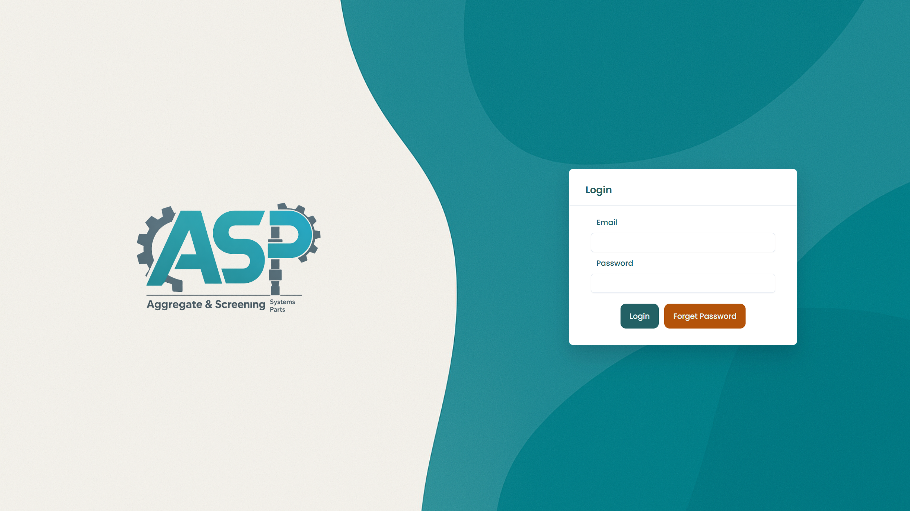</td>
    <td>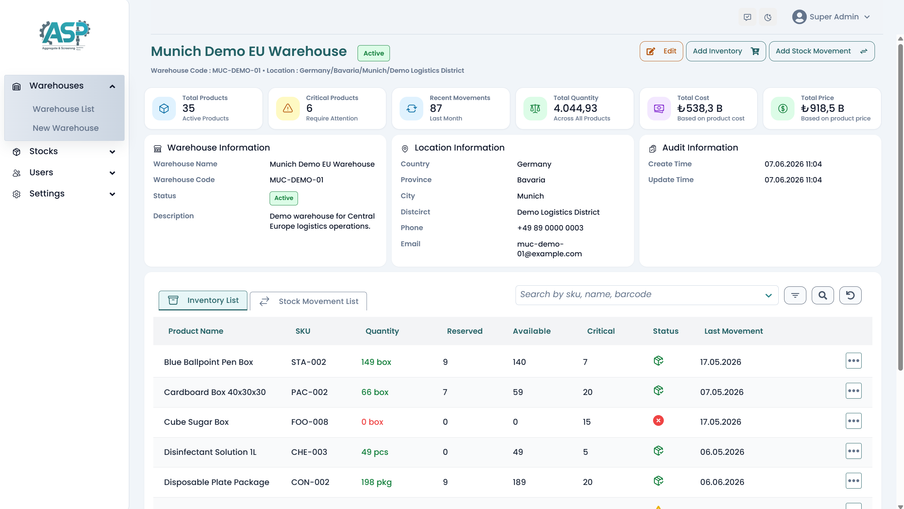</td>
    <td>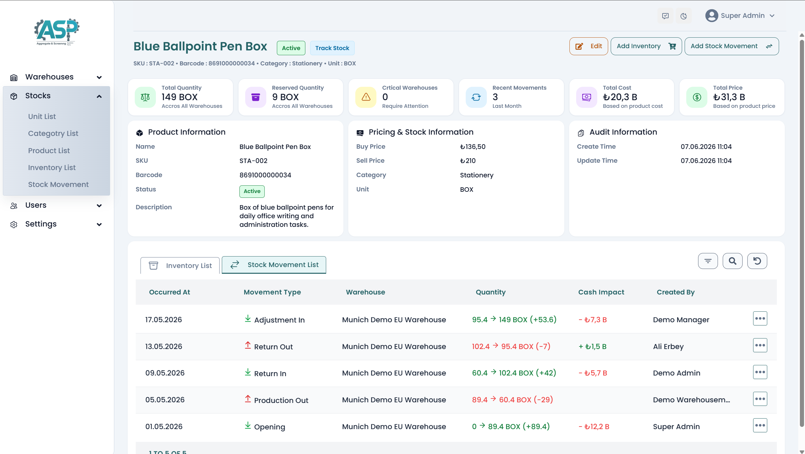</td>
  </tr>
  <tr>
    <td align="center"><strong>Dashboard</strong></td>
    <td align="center"><strong>Warehouse List</strong></td>
    <td align="center"><strong>Inventory List</strong></td>
  </tr>
  <tr>
    <td>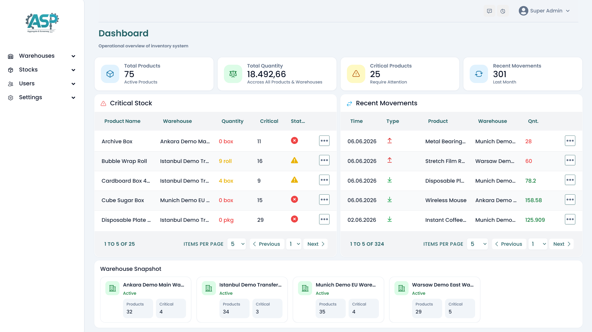</td>
    <td>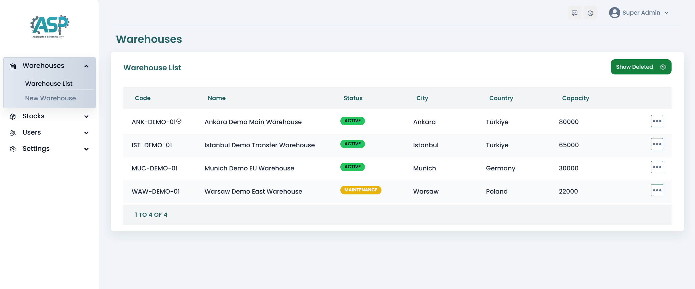</td>
    <td>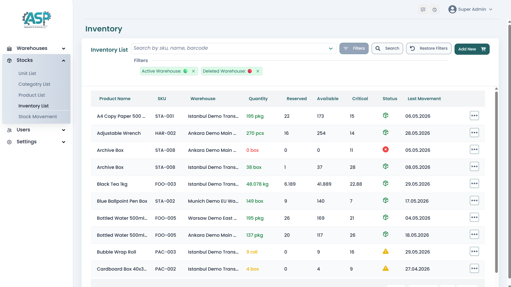</td>
  </tr>
  <tr>
    <td align="center"><strong>Movement Detail</strong></td>
    <td align="center"><strong>Movement List</strong></td>
  </tr>
  <tr>
    <td>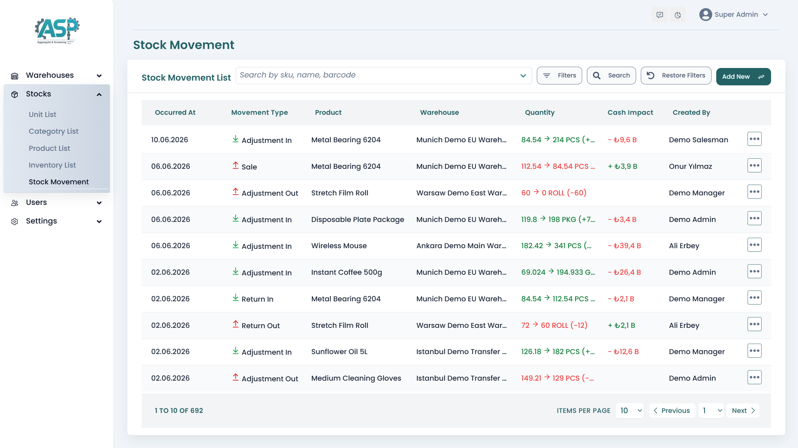</td>
    <td>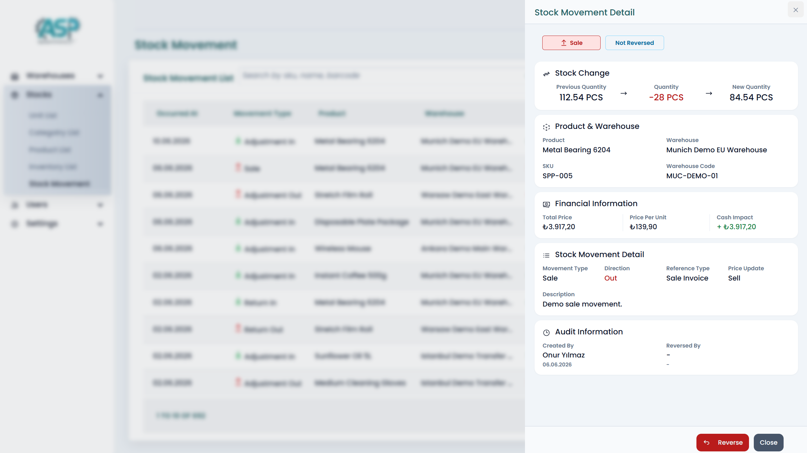</td>
  </tr>
</table>

<details>
  <summary><strong>📱 Mobile Screenshots</strong></summary>

<br />

<table>
  <tr>
    <td align="center"><strong>Login</strong></td>
    <td align="center"><strong>Warehouse Detail</strong></td>
    <td align="center"><strong>Product Detail</strong></td>
  </tr>
  <tr>
    <td>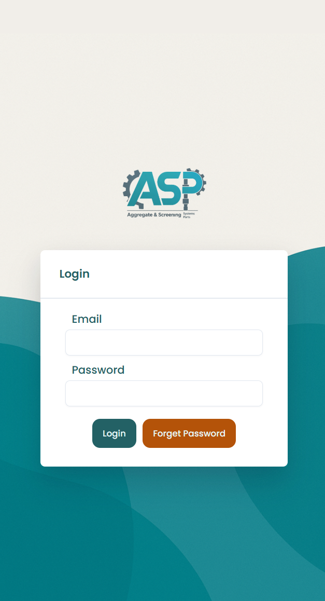</td>
    <td>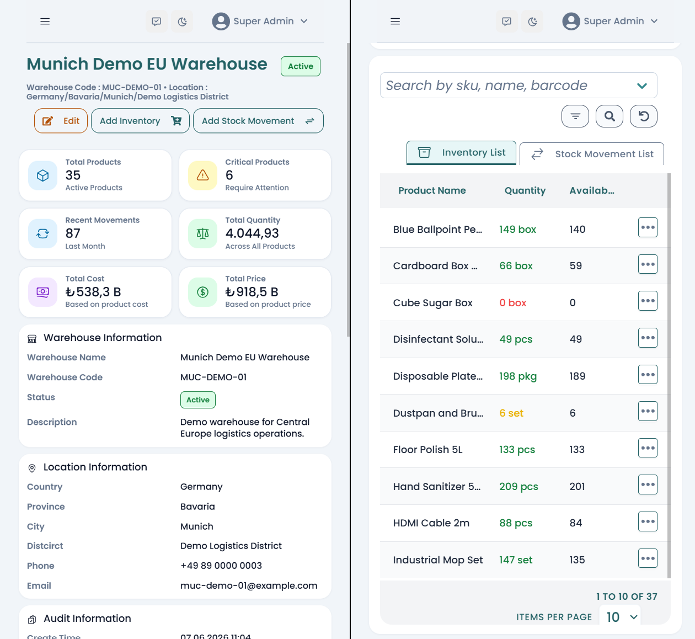</td>
    <td>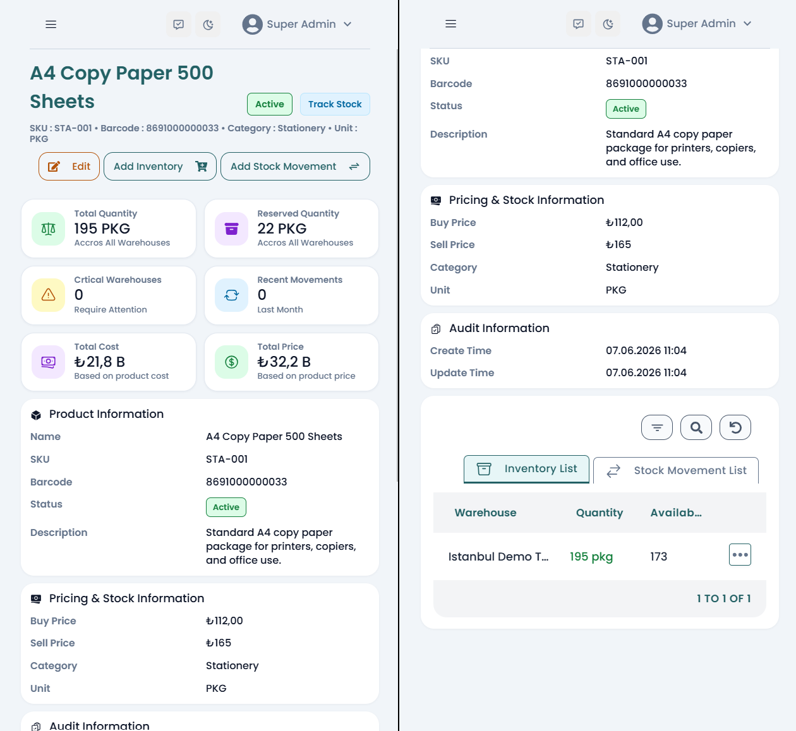</td>
  </tr>
  <tr>
    <td align="center"><strong>Dashboard</strong></td>
    <td align="center"><strong>Warehouse List</strong></td>
    <td align="center"><strong>Inventory List</strong></td>
  </tr>
  <tr>
    <td>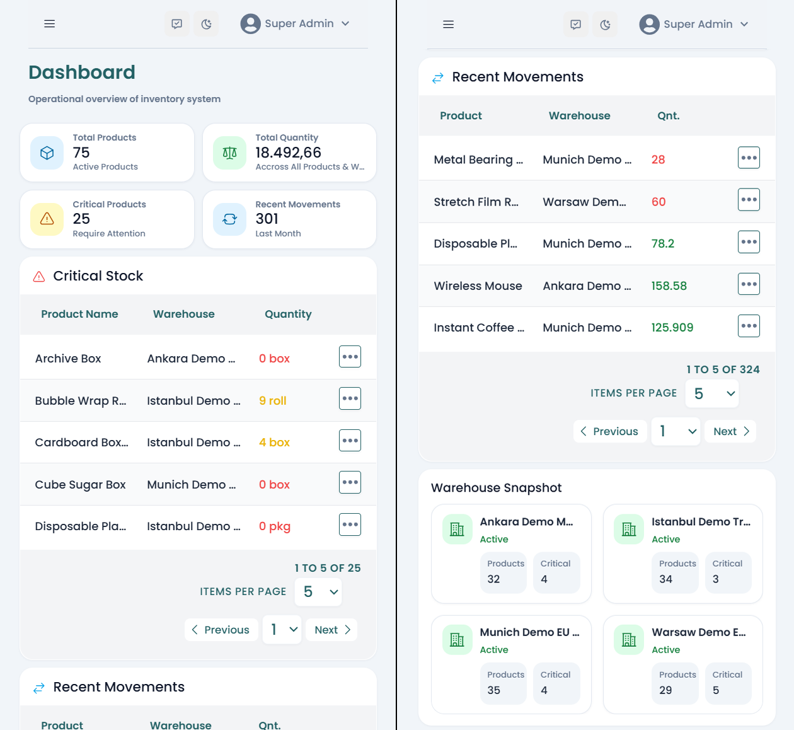</td>
    <td>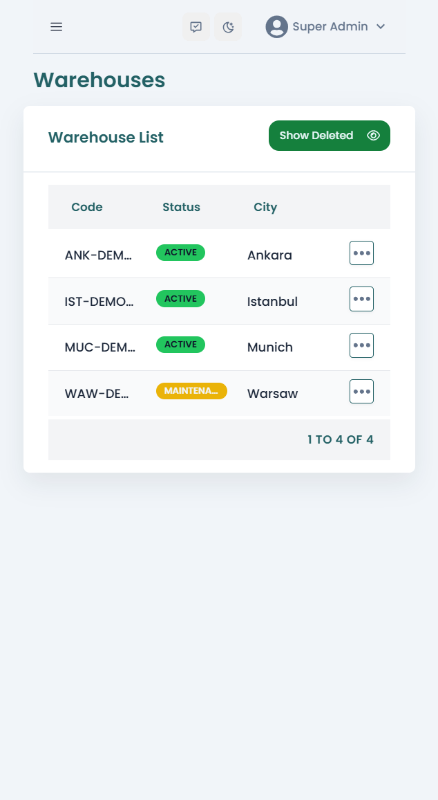</td>
    <td>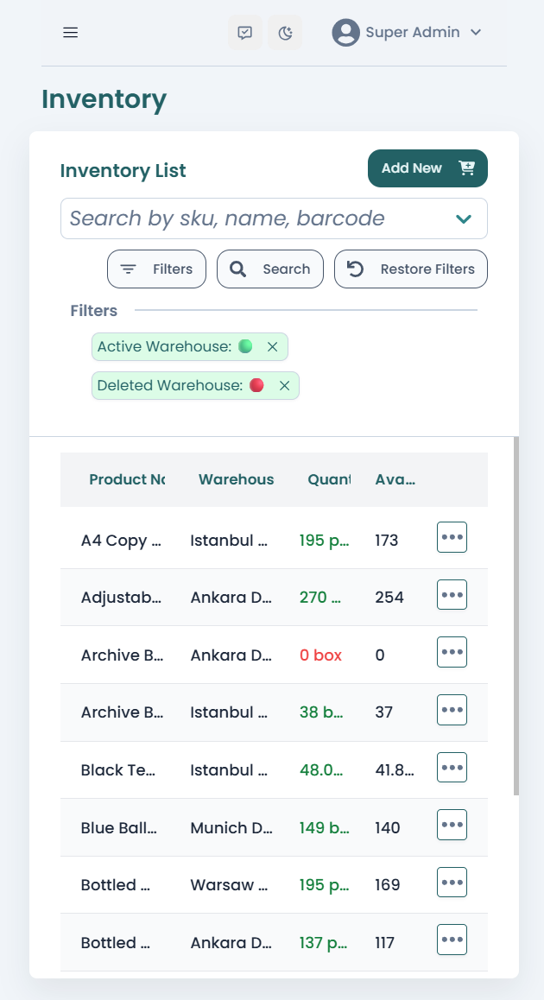</td>
  </tr>
  <tr>
    <td align="center"><strong>Movement List</strong></td>
    <td align="center"><strong>Movement Detail</strong></td>
    <td align="center"><strong>Menu</strong></td>
  </tr>
  <tr>
    <td>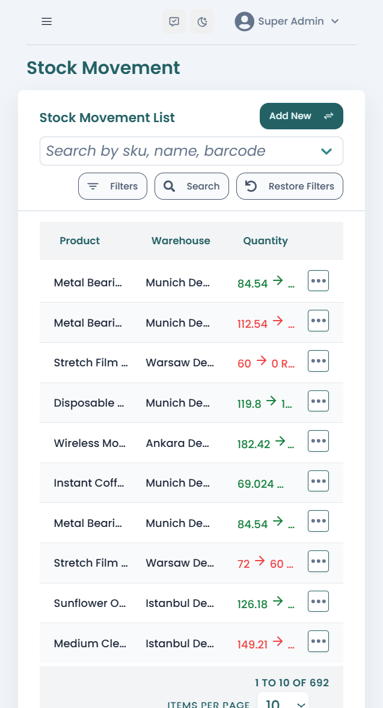</td>
    <td>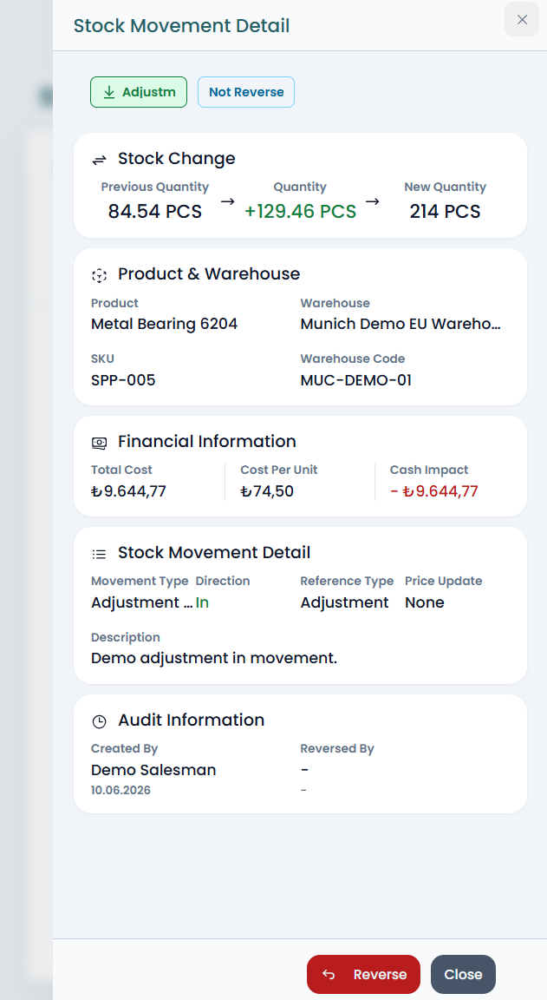</td>
    <td>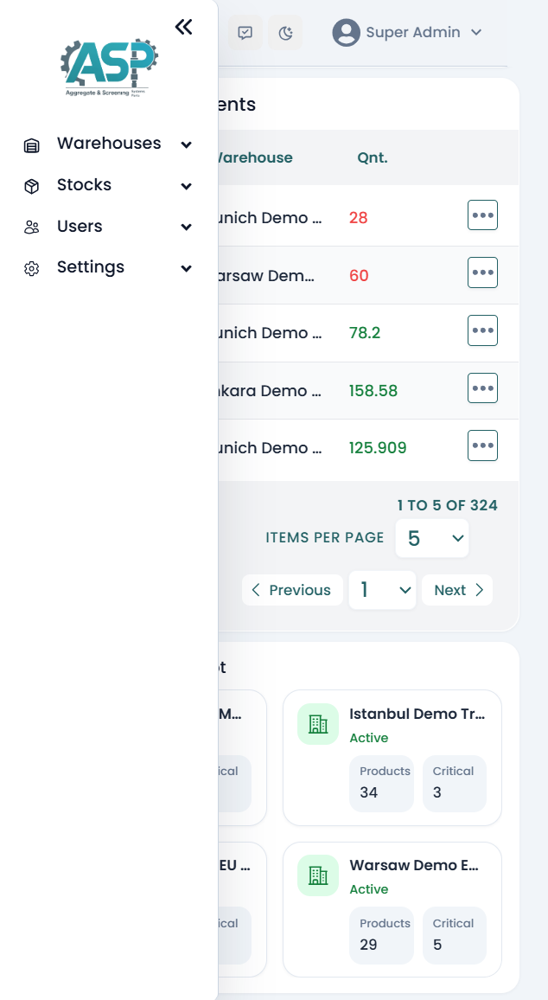</td>
  </tr>
</table>

</details>

## 🛣️ Roadmap

The current version is focused on the core ERP inventory MVP. Planned improvements include additional business modules, reporting features, and production-level refinements.

### Planned Features

- Customer management module
- Supplier management module
- Sales invoice module
- Purchase invoice module
- Stock transfer workflow improvements
- Advanced reporting and monthly performance summaries
- Audit log improvements
- Notification system
- Multi-company / multi-tenant structure
- Improved mobile navigation polish
- Scheduled demo data reset workflow
- Additional automated tests
- CI/CD pipeline improvements

The roadmap is designed to gradually evolve the project from a stock tracking MVP into a broader ERP-style resource management system.

## 🚦 Project Status

This project is currently a deployed MVP and live demo application.

Core modules such as authentication, RBAC, user management, address settings, warehouse management, product management, stock balances, stock movements, dashboard reporting, seed workflows, and Docker-based deployment are implemented.

The project is actively maintained and used as a portfolio-grade full-stack ERP case study. Future work will focus on expanding business modules, improving reporting, adding invoice workflows, increasing test coverage, and refining the mobile user experience.

## 👨‍💻 Author

Developed by **Onur Yılmaz**.

I have a project management and finance background with hands-on full-stack software development experience. This project was built as a production-oriented ERP MVP to combine real-world business process understanding with modern web application development.

### Links

- GitHub: [https://github.com/onyil44](https://github.com/onyil44)
- Project Repository: [https://github.com/onyil44/stock_tracking](https://github.com/onyil44/stock_tracking)

## License / Usage

This project is shared publicly as a portfolio project.

All rights are reserved unless otherwise stated.  
The source code is private. Access may be shared upon request for technical review.
This repository is a public showcase repository that includes project documentation, screenshots, and live demo information.  
The production source code is kept private because the project is actively maintained and contains production-oriented architecture decisions.
